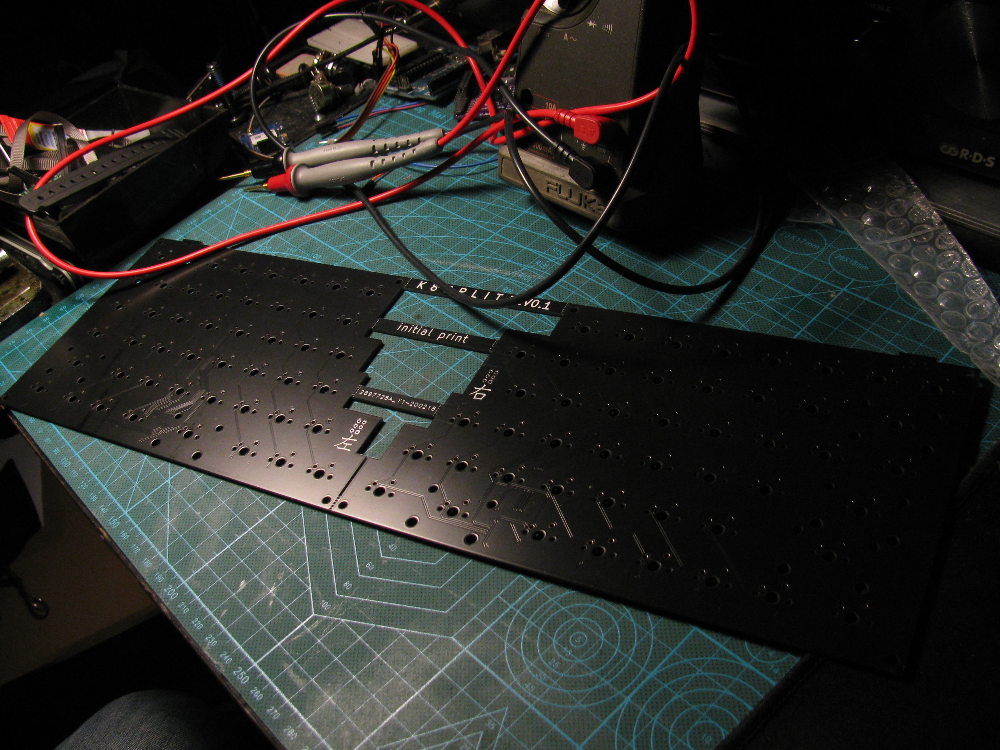

shoddy split keyboard for personal use, after ruining my [chinese split keyboard](http://xahlee.info/kbd/ly092_mini_keyboard.html) I attempted to recreate what I wanted from that, minus all the annoyances.

## features
-  *normal* layout: 
	- no ortho
	- no lack of function row
	- no weird thumbclusters
	- plenty bonus keys to add what you miss
- no case or plate, only M3 holes
- halves are separate keyboards with their own MCU and USB, none of that link cable rubbish 
- regular FULL SIZED USB PORT
- powered by [QMK](https://github.com/qmk/qmk_firmware)
- (nearly (woops)) identical matrix wiring on both halves, only keymaps differ

## pics
### keyboards

### pcb 

## mistakes in rev 0.1
- ground of programming header unconnected on right half \
header isnt needed because mcus come with the dfu usb bootloader
- matrix rows are wired reversed in the right half \
this can be fixed with a workaround in qmk's keymaps, not really a problem
- some component choices (4 pin crystal) and placement could be better for hand soldering

### will these be fixed?
probably not, it was a one off for myself anyway. it's still fully functional.

## ordering
theres an `ORDER` folder in the pcb project, which contains the component list I used (wouldnt recommend using these I picked them at cheapest price). all the other generated files needed for ordering are in `gerber/`. the limits are pretty tight so not every pcb manufacturer will put up with this, I ordered them at jlcpcb and they came in fine, cheap too.
