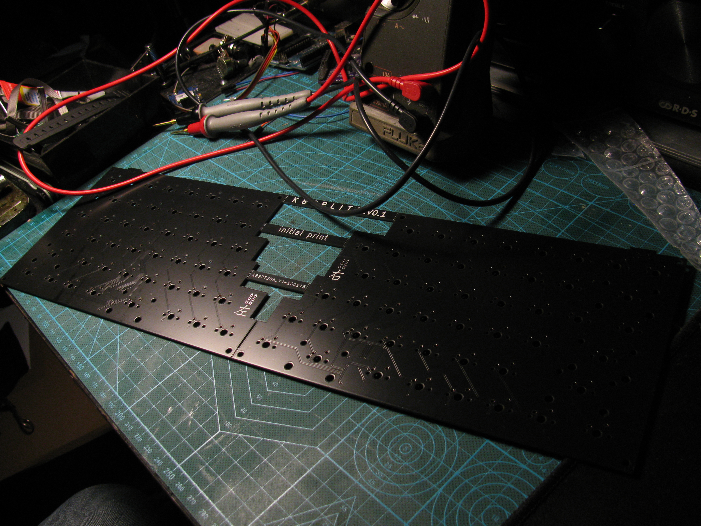

shoddy split keyboard for personal use, after ruining my [chinese split keyboard](http://xahlee.info/kbd/ly092_mini_keyboard.html) I attempted to recreate what I wanted from that, minus all the annoyances.

for the previous more scuffed and QMK version see [rev0.1](https://github.com/Ckath/k8split/tree/rev0.1)

## features
-  *normal* layout: 
	- no ortho
	- no lack of function row
	- no weird thumbclusters
	- plenty bonus keys to add what you miss
- no case or plate, only M3 holes
- halves are linked hardwired to central controller (over VGA)
- regular FULL SIZED USB PORT
- powered by TMK

## rev0.1->0.2 up/downgrades
- no more dual mcu nonsense
- no more QMK I'm not dealing with modern QMK
- no more smd 4 pin crystal suffering
- due to lack of pcb stabilizers for this formfactor: no more stabilizers
- cherry low profile switches
- boards themselves optimized for liquid damage mitigation, all throughhole for easy fixing

## pics
### keyboards
TODO
<!--  -->
<!--  -->
### pcb 
TODO
<!--  -->

## ordering
theres an `ORDER` folder in the pcb project, with all required files, dont honestly. if you want one I could probably send you one of my spare PCBs

### advice
keep in mind this is a personal board made just for myself, it's more up for reference/show than it is meant for people to actually use it. that said, some advice if you do think about making one:
- any still configured component part number is not updated, rev0.2 is made from what I had laying around and non pre assembled pcb
- to keep things easy I recommend a flat profile keycap set like dsa
- the nearly fully smd usb connector is a china find, you can find them on the regular places as "smd usb a female", the right ones should only have one shield pad on either side.
- the 'case' hardware used is a standard M3 standoff set, anything works.
